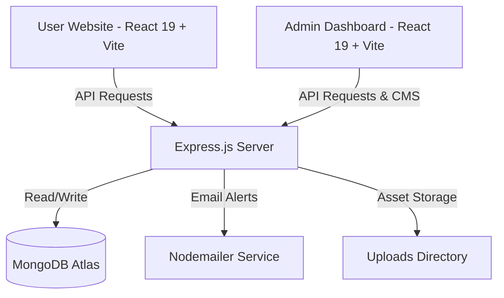

# ⛰️ Explore Pakistan - Full-Stack Travel & Tourism Platform

Explore Pakistan is a state-of-the-art, production-ready, full-stack travel booking and content management platform. The application is designed to showcase the majestic landscapes, cultural sites, and tourist adventures of Pakistan, while offering a robust administrative suite to manage bookings, user accounts, and website content in real time.

---

## 🏗️ Architecture & Component Layout

The repository is organized into a clean, modern monorepo-style structure split into three primary projects:



### Core Project Directories:
1. **`server/`**: A robust, modern Express.js REST API with ES Modules syntax, database abstractions, image upload streaming, and background email dispatchers.
2. **`user/`**: The modern customer-facing storefront featuring engaging visuals, responsive landing page sections, tour discovery, dynamic page routing, and instant booking submission.
3. **`admin/`**: A highly interactive back-office dashboard that empowers administrators to oversee all bookings, edit content layouts, publish custom pages, manage tour databases, and update user files.

---

## 🛠️ Technology Stack & Tools

### 1. The Backend (`server/`)
*   **Runtime & Framework**: **Node.js** with **Express.js** (configured with modern ES Modules: `"type": "module"`).
*   **Database**: **MongoDB** with **Mongoose ODM** for elegant schema modeling, validation, and relationships.
*   **Authentication & Security**: 
    *   **JWT (JSON Web Tokens)**: Secured token sessions (7-day duration) for seamless auth.
    *   **BcryptJS**: High-entropy password hashing and verification.
*   **File Uploads**: **Multer** integration supporting custom multipart uploads (with an increased payload ceiling of `50mb` for high-resolution tour cover images).
*   **Email Gateway**: **Nodemailer** for automated, rich HTML system notifications (on welcome events, admin logins, booking confirmations, status transitions, and secure security OTP codes).
*   **Development Tools**: **Nodemon** for live-reloading. **Validator** for strict form validations.

### 2. The Customer Website (`user/`)
*   **Framework**: **React 19** + **Vite** (for blazingly fast bundle building, hot module replacement, and optimal load performance).
*   **Styling**: **Tailwind CSS v4** (leveraging native compilation plugins via `@tailwindcss/vite` for maximum design utility).
*   **Interactive Components**: 
    *   **Radix UI**: Accessible primitives (Accordion, Aspect Ratio, Avatar, Navigation Menu, Separator, Slot).
    *   **Embla Carousel**: Fluid, touch-enabled slider loops for tour testimonials and highlights.
    *   **Lucide React & React Icons**: Sleek, vector-based line icons.
*   **Navigation**: **React Router (v7)** for swift single-page routing.
*   **State & Fetching**: **Axios** client configured with global defaults.

### 3. The Admin Dashboard (`admin/`)
*   **Framework**: **React 19** + **Vite**.
*   **Styling**: **Tailwind CSS v4** with unified animations (`tw-animate-css`).
*   **CMS Integrations**: **React Quill New** for a visual rich-text editor, enabling custom webpage formatting.
*   **Utilities**: **Moment.js** for localized date representation. **Sonner** for highly responsive toast notifications.
*   **Controls**: **Radix UI** primitives (Checkbox, Dialog, Dropdown, Select, Tabs, etc.).

---

## 🌟 Core Features & Purpose

### 🔒 1. Dynamic Authentication & Security Suite
*   **Secure Registrations**: Handles password hashing, prevents duplicate account creation, and immediately triggers an elegant welcome email to the customer.
*   **Admin Notifications**: Alerts administrators via background emails whenever a new account signs up or accesses the dashboard.
*   **Password Reset Flow**: Integrates secure **One-Time Passwords (OTP)** generated securely and sent in a polished email template. Upon OTP confirmation, password resets are permitted.

### 🎒 2. Tour Catalog & Inventory Management
*   **Tour Listings**: Displays tour cards featuring high-resolution images, precise price points, dates, and current availability status.
*   **Visual CRUD Portal**: Admins can easily add new tours, upload cover photos, alter descriptions, update costs, adjust travel dates, and manage their status (`available` or `recent`).
*   **Dynamic Media Storage**: Tour banners are processed securely, timestamped to avoid namespace collision, and served statically from `/uploads`.

### 📅 3. Interactive Booking & Dispatch Pipeline
*   **Booking Submission**: Customers can book any tour directly. The form handles participant validation, contact information logging, custom trip requests, and tour date locking.
*   **Real-time Email Alerts**:
    *   **Customer Confirmation**: Dispatches a beautifully designed HTML invoice/receipt containing tour specifics and customized travel details.
    *   **Admin Notice**: Alerts site management instantly with all traveler parameters.
*   **Status Management Suite**: Admins can track bookings through their lifecycle. Transitioning a booking status (`pending` ➡️ `processing` ➡️ `confirmed` ➡️ `completed` or `cancelled`) automatically triggers a customized email updating the traveler on their tour's status.

### ✍️ 4. Headless Content Management System (CMS)
*   **Dynamic Custom Webpages**: Admins can build custom, SEO-friendly pages directly from the dashboard using Rich Text editors. These pages are mapped to unique slugs (e.g., `/safety-guidelines`) and are dynamically rendered on the website without code redeployments.
*   **Live Homepage Editor**: Admins can visual-edit structural elements of the homepage blocks, including descriptions, FAQs, travel deals, and company profiles.
*   **Contact & About Panel**: Dynamic panels allow immediate adjustments to active helpline numbers, office locations, operational emails, live Google Maps integrations, and team vision boards.

### ✉️ 5. Customer Feedback Archive
*   **Contact Form Archives**: Submissions sent through the website contact page are captured, processed, and cataloged inside the database for administrators to view, follow up on, and manage.

---

## 📂 Database Schema Maps (MongoDB Models)

### `User` (User Management)
*   `name` (String, Required)
*   `email` (String, Required, Unique)
*   `password` (String, Required - Hashed)
*   `otp` (String, Default: `null`)
*   `isVerified` (Boolean, Default: `false`)

### `Tour` (Travel Listings)
*   `image` (String, Required)
*   `title` (String, Required)
*   `description` (String, Required)
*   `price` (String, Required)
*   `status` (String, Enum: `['available', 'recent']`, Default: `available`)
*   `startDate` (Date, Required)
*   `endDate` (Date, Required)

### `Booking` (Reservation System)
*   `firstName` / `lastName` (String, Required)
*   `email` (String, Required)
*   `phone` (String)
*   `tourId` (ObjectId referencing `Tour`)
*   `tourName` (String, Required)
*   `numberOfPeople` (Number, Default: `1`)
*   `message` (String)
*   `price` (Number)
*   `bookingDate` (Date)
*   `status` (String, Enum: `['pending', 'processing', 'confirmed', 'completed', 'cancelled']`)

### `ContactSubmission` (Lead Capture)
*   `name` / `email` / `phone` / `message` (Strings, Required)

---

## 🚀 Quick Setup & Getting Started

### 📋 Prerequisites
*   Node.js (v18+)
*   MongoDB Instance (Atlas or Local)
*   SMTP Server Credentials (for automated mailers, e.g., Gmail App Passwords)

### ⚙️ Step-by-Step Installation

1.  **Clone & Access Workspace**:
    ```bash
    git clone https://github.com/G-Mujtaba247/explore-pakistan.git
    cd explore-pakistan
    ```

2.  **Configure Environment Files**:
    Create `.env` files in their respective folders:
    
    *   **In `server/.env`**:
        ```env
        PORT=5000
        MONGODB_URL_PROD=your_mongodb_uri
        JWT_SECRET=your_jwt_signing_key
        EMAIL_USER=your_smtp_email
        EMAIL_PASS=your_smtp_app_password
        CLIENT_URL=http://localhost:5173
        ```
    *   **In `admin/.env`** and **`user/.env`**:
        ```env
        VITE_API_URL=http://localhost:5000/api/v1
        ```

3.  **Install Dependencies & Initialize Components**:
    *   **Backend Setup**:
        ```bash
        cd server
        npm install
        npm run dev # Launches API server at http://localhost:5000
        ```
    *   **Admin Dashboard Setup**:
        ```bash
        cd ../admin
        npm install
        npm run dev # Launches Dashboard at http://localhost:5173 (or next free port)
        ```
    *   **Customer Storefront Setup**:
        ```bash
        cd ../user
        npm install
        npm run dev # Launches Client Site at http://localhost:5174 (or next free port)
        ```

4.  **Seed Database (Optional)**:
    Populate Mongoose collections with stunning default tours of Kashmir Valley, Swat, Hunza, and Punjab:
    ```bash
    cd ../server
    node seed.js
    ```
